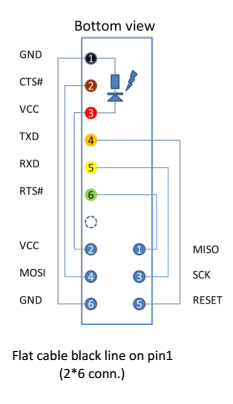
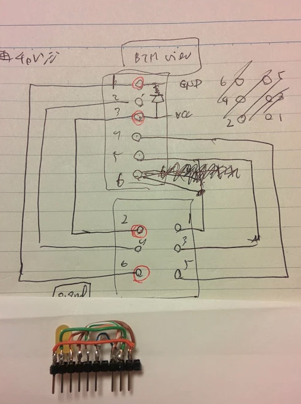

# avrdude-friend

<!---
vim: tw=74 ai ts=4 sts=4 expandtab:
-->

    $(echo "2017-04-09 Osamu Aoki <osamu#debian.org>" | sed 's/#/@/')

Since this patch is accepted in the upstream, this is only FYI.

## Scripts related to avrdude

* Makefile: burn arduino flash to ATMega328P using TTL-232R-5V etc.
* 0002-avrdude-ft245r-reset.patch: patch to fix ft232r chip as isp
    * Fixed in Debian avrdude (6.1-2) See Bug #760764 (Thu, 11 Sep 2014)
    * Fixed in the upstream
* .avrduderc: additional definition
    * No more needed since fixed in the upstream

Please read http://goofing-with-computer.blogspot.jp/ (Mostly in Japanese)
You can contact me in Japanese or English.

## How to make ISP with TTL-232R-5V

It's a bit un-intuitive, but USB to TTL level RS-232 adapter can be used
in a special bit-bang mode.  AVRDUDE supports this:

I am talking specifically the original TTL-232R-5V found in these pages:

* http://www.ftdichip.com/Products/Cables/USBTTLSerial.htm
* http://www.ftdichip.com/Support/Documents/DataSheets/Cables/DS_TTL-232R_CABLES.pdf

Connections are:
```
TTL-232R-5V       ICPS connector
 GND 1 Black  --> GND   (6 pin)
 CTS 2 Brown  --> MOSI  (4 pin)
 VCC 3 Red    --> VCC   (2 pin)
 TXD 4 Orange --> RESET (5 pin)
 RXD 5 Yellow --> SCK   (3 pin)
 RTS 6 Green  --> MISO  (1 pin)
```

Except for VCC and GND, you can connect arbitual pairs as long as the
following setting in the default `/etc/avrdude.conf` is adjusted via
`~/.avrduderc`.

```
programmer
  id    = "ttl232r";
  desc  = "FTDI TTL232R-5V with ICSP adapter";
  type  = "ftdi_syncbb";
  connection_type = usb;
  miso  = 2; # rts
  sck   = 1; # rxd
  mosi  = 3; # cts
  reset = 0; # txd
```

You can use double raw pin header as a converter.





<table cellpadding="6" cellspacing="0" style="width: 720px;">
 <colgroup><col width="83"></col>
 <col width="132"></col>
 <col width="102"></col>
 <col width="84"></col>
 <col width="138"></col>
 <col width="108"></col>
 </colgroup><tbody>
<tr>
  <td bgcolor="#ffffff" colspan="6" style="border: 1px solid #00000a; padding-bottom: 0in; padding-left: 0.06in; padding-right: 0.08in; padding-top: 0in;" valign="top" width="706"><div align="center" class="western" style="orphans: 0; widows: 0;">
FT232RL</div>
</td>
 </tr>
<tr valign="top">
  <td bgcolor="#ffffff" style="border: 1px solid #00000a; padding-bottom: 0in; padding-left: 0.06in; padding-right: 0.08in; padding-top: 0in;" width="83"><div align="center" class="western" style="orphans: 0; widows: 0;">
FT232RL</div>
</td>
  <td bgcolor="#ffffff" style="border: 1px solid #00000a; padding-bottom: 0in; padding-left: 0.06in; padding-right: 0.08in; padding-top: 0in;" width="132"><div align="center" class="western" style="orphans: 0; widows: 0;">
Bit-banging
   data</div>
</td>
  <td bgcolor="#ffffff" style="border: 1px solid #00000a; padding-bottom: 0in; padding-left: 0.06in; padding-right: 0.08in; padding-top: 0in;" width="102"><div align="center" class="western" style="orphans: 0; widows: 0;">
Diecimila/Duemilnove</div>
</td>
  <td bgcolor="#ffffff" style="border: 1px solid #00000a; padding-bottom: 0in; padding-left: 0.07in; padding-right: 0.08in; padding-top: 0in;" width="84"><div align="center" class="western" style="orphans: 0; widows: 0;">
TTL-232R</div>
</td>
  <td bgcolor="#ffffff" style="border: 1px solid #00000a; padding-bottom: 0in; padding-left: 0.07in; padding-right: 0.08in; padding-top: 0in;" width="138"><div align="center" class="western" style="orphans: 0; widows: 0;">
ttl232r Adapter</div>
</td>
  <td bgcolor="#ffffff" style="border: 1px solid #00000a; padding-bottom: 0in; padding-left: 0.06in; padding-right: 0.08in; padding-top: 0in;" width="108"><div align="center" class="western" style="orphans: 0; widows: 0;">
Uncompatino</div>
</td>
 </tr>
<tr valign="top">
  <td bgcolor="#ffffff" style="border: 1px solid #00000a; padding-bottom: 0in; padding-left: 0.06in; padding-right: 0.08in; padding-top: 0in;" width="83"><div align="center" class="western" style="orphans: 0; widows: 0;">
TXD
   (1)</div>
</td>
  <td bgcolor="#ffffff" style="border: 1px solid #00000a; padding-bottom: 0in; padding-left: 0.06in; padding-right: 0.08in; padding-top: 0in;" width="132"><div align="center" class="western" style="orphans: 0; widows: 0;">
D0</div>
</td>
  <td bgcolor="#ffffff" style="border: 1px solid #00000a; padding-bottom: 0in; padding-left: 0.06in; padding-right: 0.08in; padding-top: 0in;" width="102"><div align="center" class="western" style="orphans: 0; widows: 0;">
<br /></div>
</td>
  <td bgcolor="#ffffff" style="border: 1px solid #00000a; padding-bottom: 0in; padding-left: 0.07in; padding-right: 0.08in; padding-top: 0in;" width="84"><div align="center" class="western" style="orphans: 0; widows: 0;">
4
   ORANGE</div>
</td>
  <td bgcolor="#ffffff" style="border: 1px solid #00000a; padding-bottom: 0in; padding-left: 0.07in; padding-right: 0.08in; padding-top: 0in;" width="138"><div align="center" class="western" style="orphans: 0; widows: 0;">
5
   (RESET)</div>
</td>
  <td bgcolor="#ffffff" style="border: 1px solid #00000a; padding-bottom: 0in; padding-left: 0.06in; padding-right: 0.08in; padding-top: 0in;" width="108"><div align="center" class="western" style="orphans: 0; widows: 0;">
→
   2 ATmega</div>
</td>
 </tr>
<tr valign="top">
  <td bgcolor="#ffffff" style="border: 1px solid #00000a; padding-bottom: 0in; padding-left: 0.06in; padding-right: 0.08in; padding-top: 0in;" width="83"><div align="center" class="western" style="orphans: 0; widows: 0;">
RXD
   (5)</div>
</td>
  <td bgcolor="#ffffff" style="border: 1px solid #00000a; padding-bottom: 0in; padding-left: 0.06in; padding-right: 0.08in; padding-top: 0in;" width="132"><div align="center" class="western" style="orphans: 0; widows: 0;">
D1</div>
</td>
  <td bgcolor="#ffffff" style="border: 1px solid #00000a; padding-bottom: 0in; padding-left: 0.06in; padding-right: 0.08in; padding-top: 0in;" width="102"><div align="center" class="western" style="orphans: 0; widows: 0;">
<br /></div>
</td>
  <td bgcolor="#ffffff" style="border: 1px solid #00000a; padding-bottom: 0in; padding-left: 0.07in; padding-right: 0.08in; padding-top: 0in;" width="84"><div align="center" class="western" style="orphans: 0; widows: 0;">
5
   YELLOW</div>
</td>
  <td bgcolor="#ffffff" style="border: 1px solid #00000a; padding-bottom: 0in; padding-left: 0.07in; padding-right: 0.08in; padding-top: 0in;" width="138"><div align="center" class="western" style="orphans: 0; widows: 0;">
3
   (SCK)</div>
</td>
  <td bgcolor="#ffffff" style="border: 1px solid #00000a; padding-bottom: 0in; padding-left: 0.06in; padding-right: 0.08in; padding-top: 0in;" width="108"><div align="center" class="western" style="orphans: 0; widows: 0;">
→
   3 ATmega</div>
</td>
 </tr>
<tr valign="top">
  <td bgcolor="#ffffff" style="border: 1px solid #00000a; padding-bottom: 0in; padding-left: 0.06in; padding-right: 0.08in; padding-top: 0in;" width="83"><div align="center" class="western" style="orphans: 0; widows: 0;">
RTS#
   (3)</div>
</td>
  <td bgcolor="#ffffff" style="border: 1px solid #00000a; padding-bottom: 0in; padding-left: 0.06in; padding-right: 0.08in; padding-top: 0in;" width="132"><div align="center" class="western" style="orphans: 0; widows: 0;">
D2</div>
</td>
  <td bgcolor="#ffffff" style="border: 1px solid #00000a; padding-bottom: 0in; padding-left: 0.06in; padding-right: 0.08in; padding-top: 0in;" width="102"><div align="center" class="western" style="orphans: 0; widows: 0;">
<br /></div>
</td>
  <td bgcolor="#ffffff" style="border: 1px solid #00000a; padding-bottom: 0in; padding-left: 0.07in; padding-right: 0.08in; padding-top: 0in;" width="84"><div align="center" class="western" style="orphans: 0; widows: 0;">
6
   GREEN</div>
</td>
  <td bgcolor="#ffffff" style="border: 1px solid #00000a; padding-bottom: 0in; padding-left: 0.07in; padding-right: 0.08in; padding-top: 0in;" width="138"><div align="center" class="western" style="orphans: 0; widows: 0;">
1
   (MISO)</div>
</td>
  <td bgcolor="#ffffff" style="border: 1px solid #00000a; padding-bottom: 0in; padding-left: 0.06in; padding-right: 0.08in; padding-top: 0in;" width="108"><div align="center" class="western" style="orphans: 0; widows: 0;">
<br /></div>
</td>
 </tr>
<tr valign="top">
  <td bgcolor="#ffffff" style="border: 1px solid #00000a; padding-bottom: 0in; padding-left: 0.06in; padding-right: 0.08in; padding-top: 0in;" width="83"><div align="center" class="western" style="orphans: 0; widows: 0;">
CTS#
   (11)</div>
</td>
  <td bgcolor="#ffffff" style="border: 1px solid #00000a; padding-bottom: 0in; padding-left: 0.06in; padding-right: 0.08in; padding-top: 0in;" width="132"><div align="center" class="western" style="orphans: 0; widows: 0;">
D3</div>
</td>
  <td bgcolor="#ffffff" style="border: 1px solid #00000a; padding-bottom: 0in; padding-left: 0.06in; padding-right: 0.08in; padding-top: 0in;" width="102"><div align="center" class="western" style="orphans: 0; widows: 0;">
X3-1</div>
</td>
  <td bgcolor="#ffffff" style="border: 1px solid #00000a; padding-bottom: 0in; padding-left: 0.07in; padding-right: 0.08in; padding-top: 0in;" width="84"><div align="center" class="western" style="orphans: 0; widows: 0;">
2
   BROWN</div>
</td>
  <td bgcolor="#ffffff" style="border: 1px solid #00000a; padding-bottom: 0in; padding-left: 0.07in; padding-right: 0.08in; padding-top: 0in;" width="138"><div align="center" class="western" style="orphans: 0; widows: 0;">
4
   (MOSI)</div>
</td>
  <td bgcolor="#ffffff" style="border: 1px solid #00000a; padding-bottom: 0in; padding-left: 0.06in; padding-right: 0.08in; padding-top: 0in;" width="108"><div align="center" class="western" style="orphans: 0; widows: 0;">
o
   o→ MISO</div>
</td>
 </tr>
<tr valign="top">
  <td bgcolor="#ffffff" style="border: 1px solid #00000a; padding-bottom: 0in; padding-left: 0.06in; padding-right: 0.08in; padding-top: 0in;" width="83"><div align="center" class="western" style="orphans: 0; widows: 0;">
DTR#
   (2)</div>
</td>
  <td bgcolor="#ffffff" style="border: 1px solid #00000a; padding-bottom: 0in; padding-left: 0.06in; padding-right: 0.08in; padding-top: 0in;" width="132"><div align="center" class="western" style="orphans: 0; widows: 0;">
D4</div>
</td>
  <td bgcolor="#ffffff" style="border: 1px solid #00000a; padding-bottom: 0in; padding-left: 0.06in; padding-right: 0.08in; padding-top: 0in;" width="102"><div align="center" class="western" style="orphans: 0; widows: 0;">
<br /></div>
</td>
  <td bgcolor="#ffffff" style="border: 1px solid #00000a; padding-bottom: 0in; padding-left: 0.07in; padding-right: 0.08in; padding-top: 0in;" width="84"><div align="center" class="western" style="orphans: 0; widows: 0;">
<br /></div>
</td>
  <td bgcolor="#ffffff" style="border: 1px solid #00000a; padding-bottom: 0in; padding-left: 0.07in; padding-right: 0.08in; padding-top: 0in;" width="138"><div align="center" class="western" style="orphans: 0; widows: 0;">
<br /></div>
</td>
  <td bgcolor="#ffffff" style="border: 1px solid #00000a; padding-bottom: 0in; padding-left: 0.06in; padding-right: 0.08in; padding-top: 0in;" width="108"><div align="center" class="western" style="orphans: 0; widows: 0;">
<br /></div>
</td>
 </tr>
<tr valign="top">
  <td bgcolor="#ffffff" style="border: 1px solid #00000a; padding-bottom: 0in; padding-left: 0.06in; padding-right: 0.08in; padding-top: 0in;" width="83"><div align="center" class="western" style="orphans: 0; widows: 0;">
DSR#
   (9)</div>
</td>
  <td bgcolor="#ffffff" style="border: 1px solid #00000a; padding-bottom: 0in; padding-left: 0.06in; padding-right: 0.08in; padding-top: 0in;" width="132"><div align="center" class="western" style="orphans: 0; widows: 0;">
D5</div>
</td>
  <td bgcolor="#ffffff" style="border: 1px solid #00000a; padding-bottom: 0in; padding-left: 0.06in; padding-right: 0.08in; padding-top: 0in;" width="102"><div align="center" class="western" style="orphans: 0; widows: 0;">
X3-2</div>
</td>
  <td bgcolor="#ffffff" style="border: 1px solid #00000a; padding-bottom: 0in; padding-left: 0.07in; padding-right: 0.08in; padding-top: 0in;" width="84"><div align="center" class="western" style="orphans: 0; widows: 0;">
<br /></div>
</td>
  <td bgcolor="#ffffff" style="border: 1px solid #00000a; padding-bottom: 0in; padding-left: 0.07in; padding-right: 0.08in; padding-top: 0in;" width="138"><div align="center" class="western" style="orphans: 0; widows: 0;">
<br /></div>
</td>
  <td bgcolor="#ffffff" style="border: 1px solid #00000a; padding-bottom: 0in; padding-left: 0.06in; padding-right: 0.08in; padding-top: 0in;" width="108"><div align="center" class="western" style="orphans: 0; widows: 0;">
o
   o→ SCK</div>
</td>
 </tr>
<tr valign="top">
  <td bgcolor="#ffffff" style="border: 1px solid #00000a; padding-bottom: 0in; padding-left: 0.06in; padding-right: 0.08in; padding-top: 0in;" width="83"><div align="center" class="western" style="orphans: 0; widows: 0;">
DCD#
   (10)</div>
</td>
  <td bgcolor="#ffffff" style="border: 1px solid #00000a; padding-bottom: 0in; padding-left: 0.06in; padding-right: 0.08in; padding-top: 0in;" width="132"><div align="center" class="western" style="orphans: 0; widows: 0;">
D6</div>
</td>
  <td bgcolor="#ffffff" style="border: 1px solid #00000a; padding-bottom: 0in; padding-left: 0.06in; padding-right: 0.08in; padding-top: 0in;" width="102"><div align="center" class="western" style="orphans: 0; widows: 0;">
X3-3</div>
</td>
  <td bgcolor="#ffffff" style="border: 1px solid #00000a; padding-bottom: 0in; padding-left: 0.07in; padding-right: 0.08in; padding-top: 0in;" width="84"><div align="center" class="western" style="orphans: 0; widows: 0;">
<br /></div>
</td>
  <td bgcolor="#ffffff" style="border: 1px solid #00000a; padding-bottom: 0in; padding-left: 0.07in; padding-right: 0.08in; padding-top: 0in;" width="138"><div align="center" class="western" style="orphans: 0; widows: 0;">
<br /></div>
</td>
  <td bgcolor="#ffffff" style="border: 1px solid #00000a; padding-bottom: 0in; padding-left: 0.06in; padding-right: 0.08in; padding-top: 0in;" width="108"><div align="center" class="western" style="orphans: 0; widows: 0;">
o
   o→ MOSI</div>
</td>
 </tr>
<tr valign="top">
  <td bgcolor="#ffffff" style="border: 1px solid #00000a; padding-bottom: 0in; padding-left: 0.06in; padding-right: 0.08in; padding-top: 0in;" width="83"><div align="center" class="western" style="orphans: 0; widows: 0;">
RI#
   (6)</div>
</td>
  <td bgcolor="#ffffff" style="border: 1px solid #00000a; padding-bottom: 0in; padding-left: 0.06in; padding-right: 0.08in; padding-top: 0in;" width="132"><div align="center" class="western" style="orphans: 0; widows: 0;">
D7</div>
</td>
  <td bgcolor="#ffffff" style="border: 1px solid #00000a; padding-bottom: 0in; padding-left: 0.06in; padding-right: 0.08in; padding-top: 0in;" width="102"><div align="center" class="western" style="orphans: 0; widows: 0;">
X3-4</div>
</td>
  <td bgcolor="#ffffff" style="border: 1px solid #00000a; padding-bottom: 0in; padding-left: 0.07in; padding-right: 0.08in; padding-top: 0in;" width="84"><div align="center" class="western" style="orphans: 0; widows: 0;">
<br /></div>
</td>
  <td bgcolor="#ffffff" style="border: 1px solid #00000a; padding-bottom: 0in; padding-left: 0.07in; padding-right: 0.08in; padding-top: 0in;" width="138"><div align="center" class="western" style="orphans: 0; widows: 0;">
<br /></div>
</td>
  <td bgcolor="#ffffff" style="border: 1px solid #00000a; padding-bottom: 0in; padding-left: 0.06in; padding-right: 0.08in; padding-top: 0in;" width="108"><div align="center" class="western" style="orphans: 0; widows: 0;">
o
   o→ RESET</div>
</td>
 </tr>
<tr valign="top">
  <td bgcolor="#ffffff" style="border: 1px solid #00000a; padding-bottom: 0in; padding-left: 0.06in; padding-right: 0.08in; padding-top: 0in;" width="83"><div align="center" class="western" style="orphans: 0; widows: 0;">
VCC</div>
</td>
  <td bgcolor="#ffffff" style="border: 1px solid #00000a; padding-bottom: 0in; padding-left: 0.06in; padding-right: 0.08in; padding-top: 0in;" width="132"><div align="center" class="western" style="orphans: 0; widows: 0;">
<br /></div>
</td>
  <td bgcolor="#ffffff" style="border: 1px solid #00000a; padding-bottom: 0in; padding-left: 0.06in; padding-right: 0.08in; padding-top: 0in;" width="102"><div align="center" class="western" style="orphans: 0; widows: 0;">
<br /></div>
</td>
  <td bgcolor="#ffffff" style="border: 1px solid #00000a; padding-bottom: 0in; padding-left: 0.07in; padding-right: 0.08in; padding-top: 0in;" width="84"><div align="center" class="western" style="orphans: 0; widows: 0;">
3
   RED</div>
</td>
  <td bgcolor="#ffffff" style="border: 1px solid #00000a; padding-bottom: 0in; padding-left: 0.07in; padding-right: 0.08in; padding-top: 0in;" width="138"><div align="center" class="western" style="orphans: 0; widows: 0;">
2
   (VCC)</div>
</td>
  <td bgcolor="#ffffff" style="border: 1px solid #00000a; padding-bottom: 0in; padding-left: 0.06in; padding-right: 0.08in; padding-top: 0in;" width="108"><div align="center" class="western" style="orphans: 0; widows: 0;">
<br /></div>
</td>
 </tr>
<tr valign="top">
  <td bgcolor="#ffffff" style="border: 1px solid #00000a; padding-bottom: 0in; padding-left: 0.06in; padding-right: 0.08in; padding-top: 0in;" width="83"><div align="center" class="western" style="orphans: 0; widows: 0;">
GND</div>
</td>
  <td bgcolor="#ffffff" style="border: 1px solid #00000a; padding-bottom: 0in; padding-left: 0.06in; padding-right: 0.08in; padding-top: 0in;" width="132"><div align="center" class="western" style="orphans: 0; widows: 0;">
<br /></div>
</td>
  <td bgcolor="#ffffff" style="border: 1px solid #00000a; padding-bottom: 0in; padding-left: 0.06in; padding-right: 0.08in; padding-top: 0in;" width="102"><div align="center" class="western" style="orphans: 0; widows: 0;">
<br /></div>
</td>
  <td bgcolor="#ffffff" style="border: 1px solid #00000a; padding-bottom: 0in; padding-left: 0.07in; padding-right: 0.08in; padding-top: 0in;" width="84"><div align="center" class="western" style="orphans: 0; widows: 0;">
1
   BLACK</div>
</td>
  <td bgcolor="#ffffff" style="border: 1px solid #00000a; padding-bottom: 0in; padding-left: 0.07in; padding-right: 0.08in; padding-top: 0in;" width="138"><div align="center" class="western" style="orphans: 0; widows: 0;">
6
   (GND)</div>
</td>
  <td bgcolor="#ffffff" style="border: 1px solid #00000a; padding-bottom: 0in; padding-left: 0.06in; padding-right: 0.08in; padding-top: 0in;" width="108"><div align="center" class="western" style="orphans: 0; widows: 0;">
<br /></div>
</td>
 </tr>
</tbody></table>
<div class="western" style="line-height: 100%; margin-bottom: 0in; orphans: 0; widows: 0;">
<br /></div>
<table cellpadding="6" cellspacing="0" style="width: 270px;">
 <colgroup><col width="101"></col>
 <col width="54"></col>
 <col width="77"></col>
 </colgroup><tbody>
<tr>
  <td bgcolor="#ffffff" colspan="3" style="border: 1px solid #00000a; padding-bottom: 0in; padding-left: 0.06in; padding-right: 0.08in; padding-top: 0in;" valign="top" width="256"><div align="center" class="western" style="orphans: 0; widows: 0;">
Arduino
   main MCU side</div>
</td>
 </tr>
<tr valign="top">
  <td bgcolor="#ffffff" style="border: 1px solid #00000a; padding-bottom: 0in; padding-left: 0.06in; padding-right: 0.08in; padding-top: 0in;" width="101"><div class="western" style="orphans: 0; widows: 0;">
ATMega328</div>
</td>
  <td bgcolor="#ffffff" style="border: 1px solid #00000a; padding-bottom: 0in; padding-left: 0.06in; padding-right: 0.08in; padding-top: 0in;" width="54"><div class="western" style="orphans: 0; widows: 0;">
ICPS</div>
</td>
  <td bgcolor="#ffffff" style="border: 1px solid #00000a; padding-bottom: 0in; padding-left: 0.06in; padding-right: 0.08in; padding-top: 0in;" width="77"><div class="western" style="orphans: 0; widows: 0;">
Arduino</div>
</td>
 </tr>
<tr valign="top">
  <td bgcolor="#ffffff" style="border: 1px solid #00000a; padding-bottom: 0in; padding-left: 0.06in; padding-right: 0.08in; padding-top: 0in;" width="101"><div class="western" style="orphans: 0; widows: 0;">
MOSI (17)</div>
</td>
  <td bgcolor="#ffffff" style="border: 1px solid #00000a; padding-bottom: 0in; padding-left: 0.06in; padding-right: 0.08in; padding-top: 0in;" width="54"><div class="western" style="orphans: 0; widows: 0;">
4</div>
</td>
  <td bgcolor="#ffffff" style="border: 1px solid #00000a; padding-bottom: 0in; padding-left: 0.06in; padding-right: 0.08in; padding-top: 0in;" width="77"><div class="western" style="orphans: 0; widows: 0;">
J3-4 (D11)</div>
</td>
 </tr>
<tr valign="top">
  <td bgcolor="#ffffff" style="border: 1px solid #00000a; padding-bottom: 0in; padding-left: 0.06in; padding-right: 0.08in; padding-top: 0in;" width="101"><div class="western" style="orphans: 0; widows: 0;">
MISO (18)</div>
</td>
  <td bgcolor="#ffffff" style="border: 1px solid #00000a; padding-bottom: 0in; padding-left: 0.06in; padding-right: 0.08in; padding-top: 0in;" width="54"><div class="western" style="orphans: 0; widows: 0;">
1</div>
</td>
  <td bgcolor="#ffffff" style="border: 1px solid #00000a; padding-bottom: 0in; padding-left: 0.06in; padding-right: 0.08in; padding-top: 0in;" width="77"><div class="western" style="orphans: 0; widows: 0;">
J3-5 (D12)</div>
</td>
 </tr>
<tr valign="top">
  <td bgcolor="#ffffff" style="border: 1px solid #00000a; padding-bottom: 0in; padding-left: 0.06in; padding-right: 0.08in; padding-top: 0in;" width="101"><div class="western" style="orphans: 0; widows: 0;">
SCK (19)</div>
</td>
  <td bgcolor="#ffffff" style="border: 1px solid #00000a; padding-bottom: 0in; padding-left: 0.06in; padding-right: 0.08in; padding-top: 0in;" width="54"><div class="western" style="orphans: 0; widows: 0;">
3 
   </div>
</td>
  <td bgcolor="#ffffff" style="border: 1px solid #00000a; padding-bottom: 0in; padding-left: 0.06in; padding-right: 0.08in; padding-top: 0in;" width="77"><div class="western" style="orphans: 0; widows: 0;">
J3-6 (D13)</div>
</td>
 </tr>
<tr valign="top">
  <td bgcolor="#ffffff" style="border: 1px solid #00000a; padding-bottom: 0in; padding-left: 0.06in; padding-right: 0.08in; padding-top: 0in;" width="101"><div class="western" style="orphans: 0; widows: 0;">
RESET (1)</div>
</td>
  <td bgcolor="#ffffff" style="border: 1px solid #00000a; padding-bottom: 0in; padding-left: 0.06in; padding-right: 0.08in; padding-top: 0in;" width="54"><div class="western" style="orphans: 0; widows: 0;">
5</div>
</td>
  <td bgcolor="#ffffff" style="border: 1px solid #00000a; padding-bottom: 0in; padding-left: 0.06in; padding-right: 0.08in; padding-top: 0in;" width="77"><div class="western" style="orphans: 0; widows: 0;">
Switch</div>
</td>
 </tr>
<tr valign="top">
  <td bgcolor="#ffffff" style="border: 1px solid #00000a; padding-bottom: 0in; padding-left: 0.06in; padding-right: 0.08in; padding-top: 0in;" width="101"><div class="western" style="orphans: 0; widows: 0;">
VCC</div>
</td>
  <td bgcolor="#ffffff" style="border: 1px solid #00000a; padding-bottom: 0in; padding-left: 0.06in; padding-right: 0.08in; padding-top: 0in;" width="54"><div class="western" style="orphans: 0; widows: 0;">
2</div>
</td>
  <td bgcolor="#ffffff" style="border: 1px solid #00000a; padding-bottom: 0in; padding-left: 0.06in; padding-right: 0.08in; padding-top: 0in;" width="77"><div class="western" style="orphans: 0; widows: 0;">
<br /></div>
</td>
 </tr>
<tr valign="top">
  <td bgcolor="#ffffff" style="border: 1px solid #00000a; padding-bottom: 0in; padding-left: 0.06in; padding-right: 0.08in; padding-top: 0in;" width="101"><div class="western" style="orphans: 0; widows: 0;">
GND</div>
</td>
  <td bgcolor="#ffffff" style="border: 1px solid #00000a; padding-bottom: 0in; padding-left: 0.06in; padding-right: 0.08in; padding-top: 0in;" width="54"><div class="western" style="orphans: 0; widows: 0;">
6</div>
</td>
  <td bgcolor="#ffffff" style="border: 1px solid #00000a; padding-bottom: 0in; padding-left: 0.06in; padding-right: 0.08in; padding-top: 0in;" width="77"><div class="western" style="orphans: 0; widows: 0;">
<br /></div>
</td>
 </tr>
</tbody></table>

## LICENSE

Unless otherwise stated, all these files in this tarball/git-repo are licensed
as follows:

Permission is hereby granted, free of charge, to any person obtaining a
copy of this software and associated documentation files (the
"Software"), to deal in the Software without restriction, including
without limitation the rights to use, copy, modify, merge, publish,
distribute, sublicense, and/or sell copies of the Software, and to
permit persons to whom the Software is furnished to do so, subject to
the following conditions:

THE SOFTWARE IS PROVIDED "AS IS", WITHOUT WARRANTY OF ANY KIND, EXPRESS
OR IMPLIED, INCLUDING BUT NOT LIMITED TO THE WARRANTIES OF
MERCHANTABILITY, FITNESS FOR A PARTICULAR PURPOSE AND NONINFRINGEMENT.
IN NO EVENT SHALL THE AUTHORS OR COPYRIGHT HOLDERS BE LIABLE FOR ANY
CLAIM, DAMAGES OR OTHER LIABILITY, WHETHER IN AN ACTION OF CONTRACT,
TORT OR OTHERWISE, ARISING FROM, OUT OF OR IN CONNECTION WITH THE
SOFTWARE OR THE USE OR OTHER DEALINGS IN THE SOFTWARE.

## NOTE

I will use this repo's wiki to record some information related to AVR
systems I play with.  See https://github.com/osamuaoki/avrdude-friend/wiki

